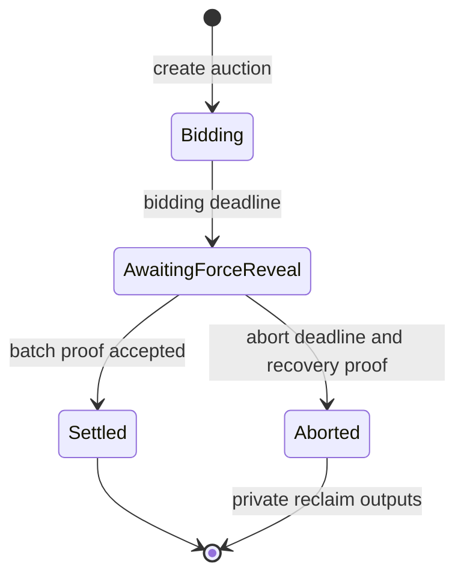

# Whisper Private Vickrey Auction Protocol

**Status:** Reference Cairo contract and STRK20 ComputeAndInvoke metadata path implemented; escrow/settlement proof integration unimplemented; not audited
**Updated:** 2026-08-23

## Decision

Whisper targets a token-agnostic Vickrey auction whose bids are escrowed encrypted notes in a configured STRK20 privacy pool. The highest valid bid wins, pays the greater of the reserve price and the second-highest valid bid, receives any excess as a private refund, and exposes only an application-defined `winner_commitment` as the result identity; the current implementation has not yet completed the escrow proof.

V1 uses a single 1-of-1 force-reveal operator after bidding closes. There is no bidder-triggered reveal transaction in V1; future releases may accept user-generated reveal proofs through a paymastered execute-from-outside flow.

The protocol follows the intent of the [STRK20 sealed-bid auction RFP](https://strk20.starknet.io/rfp/sealed-bid-auctions): actual encrypted escrowed funds, deadline-bound disclosure, verified ranking, and recovery when a bidder is unavailable.

## Library boundary

The auction package knows nothing about games, authorities, NFTs, governance, or the asset being sold. It owns only payment-side auction state and publishes a generic result.

An integrating application chooses how to interpret:

- `metadata_hash`: commitment to the lot or application-specific listing data.
- `winner_payload_domain`: domain separator defining the meaning of the winner commitment.
- `winner_commitment`: opaque commitment supplied inside the private action and bound to the sealed bid; settlement publishes which stored commitment won.

The application may interpret `winner_commitment` as a claim key, recipient commitment, capability key, account commitment, or another identifier. V1 performs no callback into the consuming application during settlement; consumers read the immutable result or use a separately reviewed adapter, avoiding callback failure and reentrancy in the payment path.

## Why a pool/prover extension is required

The current privacy pool supports encrypted-note creation and consumption, public deposit/withdrawal legs, and `ComputeAndInvoke`. Whisper now uses that action to derive an auction-scoped identity inside the proven client computation and to authenticate the public bid transcript, without receiving the wallet's viewing key or identity key.

The stable app-facing API still does not expose the newly created encrypted-note ID to the invoke callback or prove that a referenced note was created for the auction vault with the configured token and an in-range hidden amount. It also cannot lock that note against ordinary spending, prove a later amount reveal, or atomically redistribute all bids under Vickrey rules.

### Upstream compatibility snapshot

This implementation was checked on 2026-08-23 against `starkware-libs/starknet-privacy` commit `36eac4ea88cd8c59dde1493176e16501c6e90328`. It matches the pool's `ComputeAndInvokeInput`, `privacy_compute` selector, `privacy_invoke_with_computation` selector, and `(Span<OpenNoteDeposit>, Span<ContractAddress>)` return shape; compatibility must be re-verified before deployment because the upstream repository is active.

A normal anonymizer is insufficient because withdrawing a variable bid amount makes the amount public before the deadline. The required implementation is therefore a custom client/prover action plus a compatible pool contract branch, either accepted upstream or clearly labeled as a Sepolia-only fork.

## Distributable package

Package name: `whisper`.

```text
contracts/
  Scarb.toml
  Scarb.lock
  README.md
  src/
    lib.cairo
    auction.cairo
    interface.cairo
    types.cairo
    pricing.cairo
    tests.cairo
```

The current package exports:

- A deployable `WhisperAuction` reference contract.
- Stable auction configuration, bid-record, result, status, event, ABI dispatcher, and calldata types.
- A minimal `IWhisperAuction` interface.
- A pure `compute_vickrey_price` helper for consumers and tests.
- A domain-separated rolling commitment to each auction's ordered bid handles.

Consumers can import the package as a Scarb path or Git dependency and deploy the reference contract independently of any application framework. An embeddable Cairo component and canonical cross-language hash vectors remain follow-on packaging work.

The privacy-pool actions, prover program, SDK builder, and force-reveal operator remain separate companion artifacts because a normal Cairo package cannot add proof actions to an already-deployed pool.

## Configuration

### Deployment configuration

```text
pool_address
protocol_admin
force_reveal_public_key
force_reveal_threshold = 1
force_reveal_members = 1
```

`pool_address` is constructor-injected so the package is usable across networks and compatible pool deployments. An upgrade or configuration change must never strand active auction notes.

### Per-auction configuration

```text
payment_token
proceeds_recipient_commitment
metadata_hash
winner_payload_domain
reserve_price
max_bid
max_bids
bidding_deadline
force_reveal_after
abort_after
vault_address
vault_public_key
```

All configuration is snapshotted and immutable after the first bid. `payment_token` may be any ERC-20 supported by the configured privacy pool; the proof binds every accepted bid and every output note to that exact token.

## External interface

The exact Cairo ABI remains team-owned, but the contract boundary should provide these operations:

```text
create_auction(config) -> auction_id
record_bid(pool_authenticated_bid)
privacy_compute(identity_key, bid_intent) -> pool_authenticated_bid
privacy_invoke_with_computation(pool_authenticated_bid) -> ([], [])
force_reveal_and_settle(pool_authenticated_settlement)
abort_auction(pool_authenticated_recovery)
get_auction(auction_id) -> auction
get_bid(auction_id, bid_handle) -> sealed_bid
get_result(auction_id) -> result
```

Authorization rules:

- Anyone may create an auction unless a host contract chooses a stricter policy.
- The configured pool may call `privacy_invoke_with_computation` with the result of Whisper's proven `privacy_compute` call.
- Only the configured privacy pool may call `record_bid`, `force_reveal_and_settle`, or the proof-backed recovery path.
- The transaction sender is never treated as the bidder, winner, or force-reveal operator.
- Settlement and abort are one-shot state transitions.

## State model

```text
Auction
  id
  creator
  pool_address
  payment_token
  proceeds_recipient_commitment
  metadata_hash
  winner_payload_domain
  reserve_price
  max_bid
  max_bids
  bidding_deadline
  force_reveal_after
  abort_after
  vault_address
  vault_public_key
  accepted_bids_root
  bid_count
  status
  settlement_hash

AuctionResult
  auction_id
  winner_commitment
  winning_bid
  second_highest_bid
  clearing_price
  reveals_root
  outputs_root
  settled_at

SealedBid
  auction_id
  bid_handle
  identity_commitment
  note_id
  capsule_hash
  refund_commitment
  submitted_at
  settled
```

`winner_commitment`, `identity_commitment`, and `refund_commitment` must be freshly derived per auction. Reuse creates correlation even if no wallet address is directly disclosed.

## Vickrey rules

- Accept only bids within the inclusive `reserve_price` and `max_bid` bounds.
- Rank valid bids by amount descending, then `bid_handle` ascending.
- The highest-ranked bid wins.
- `clearing_price = max(reserve_price, second_highest_bid)`.
- With exactly one valid bid, the winner pays `reserve_price`.
- With no valid bids, the result has no winner and creates no proceeds note.
- A tie at the highest amount makes the tied amount the second order statistic, so the deterministic winner pays the full tied amount.
- The winner receives `winning_bid - clearing_price` privately; omit a zero-value refund note.
- Every loser receives its full bid privately.
- Invalid or forfeited value is accounted for separately and never affects ranking or the clearing price.

## Bid flow

The bidder shields the selected ERC-20 in an earlier transaction. Bundling a public deposit with a bid would expose the funding wallet and amount next to the bid transaction.

At bid time the wallet or team-controlled SDK generates:

```text
private identity
refund commitment
winner payload and commitment
auction-scoped reveal capsule
encrypted audit material
```

The proposed `CreateAuctionBid` proof action atomically:

1. Consumes sufficient mature shielded notes of `payment_token`.
2. Creates an encrypted bid note owned by the restricted auction vault.
3. Returns excess input value to the bidder as private change.
4. Proves the bid is within the snapshotted bounds.
5. Derives the note ID and bid handle inside the proven computation.
6. Locks the note to `auction_id`, preventing generic note consumption.
7. Binds the refund commitment, winner commitment, and audit capsule to the note.
8. Invokes `record_bid` with only the proof-authenticated public record.

Suggested identifiers:

```text
identity_commitment = Poseidon("WHISPER_ID_V1", identity_key, auction_id)
bid_handle          = Poseidon("WHISPER_BID_V1", auction_id, identity_commitment, note_id, capsule_hash, refund_commitment, winner_commitment)
settlement_hash     = Poseidon("WHISPER_SET_V1", auction_id, reveals_root, outputs_root)
```

Exact encoding, length prefixes, field order, and numeric bounds must be shared by canonical Cairo and TypeScript test vectors.

## V1 force reveal and settlement

V1 intentionally removes the voluntary reveal path. After `force_reveal_after`, the 1-of-1 operator processes the complete accepted-bid set and produces one batch `force_reveal_and_settle` proof.

The batch proof must:

1. Cover exactly the bid handles committed by `accepted_bids_root` and `bid_count`.
2. Prove each revealed amount, token, refund commitment, and winner commitment belongs to its locked encrypted note.
3. Reject execution before `force_reveal_after` or after settlement/abort.
4. Recompute the deterministic winner, second-highest bid, and clearing price.
5. Nullify every locked bid note exactly once.
6. Create a full private refund note for each loser.
7. Create a private winner refund for `winning_bid - clearing_price`, if non-zero.
8. Create a private `payment_token` note worth `clearing_price` for `proceeds_recipient_commitment`.
9. Publish only the winning `winner_commitment` plus the public result and settlement roots.
10. Bind all outputs to one settlement hash accepted exactly once by the auction contract.

The proof may be submitted by any relayer. The force-reveal operator produces decryption material and the proof input but must not gain discretion over the winner, refunds, proceeds recipient, or output amounts.

## State machine



## Future user-assisted reveal

A later version may enable an already-defined reveal-proof variant after bidding closes. A wallet could prepare or schedule a paymastered execute-from-outside call so the bidder does not need to reopen the application at the deadline.

That future path should:

- Reuse the same `bid_handle`, reveal verification, and settlement rules.
- Allow a force reveal to race safely with a voluntary reveal; the first valid proof wins and replay protection rejects the second.
- Never expose reusable viewing keys or whole channel keys.
- Reduce reliance on the operator for participating users without making it a V1 dependency.

## Privacy statement

| Hidden | Public |
|---|---|
| Bidder wallet | Auction creator and immutable configuration |
| Bid amount before settlement | Payment token, bid count, submission timing |
| Note plaintext, refund recipient, winner payload | Bid handles, encrypted note IDs and ciphertexts |
| Wallet-to-winner link | Revealed bid amounts, winner commitment, winning bid, clearing price and roots |
| Private refund and proceeds destinations | Any separate public shield or unshield amounts |

The selected payment token is public because it is an auction parameter. Its amount remains encrypted until settlement.

## 1-of-1 trust boundary

The force-reveal configuration is initially `threshold = 1`, `members = 1`.

- Onchain timing prevents an early reveal transaction from being accepted.
- Proof constraints prevent the operator from selecting a different winner or redirecting outputs.
- The single operator has enough offchain capability to learn bid amounts before the deadline; the protocol cannot cryptographically prevent that operator from inspecting decrypted data early.
- Operator unavailability blocks normal settlement, so private abort recovery is mandatory.
- Moving later to `t-of-n` removes the single point of availability failure but still permits early disclosure if `t` members collude.

The V1 demo must state this assumption and must not describe the design as committee-free confidentiality.

## Failure and recovery rules

- Bid after deadline or above `max_bids`: reject before creating an auction lock.
- Wrong token or out-of-range amount: reject through proof verification.
- Duplicate private identity: reject the second bid.
- Incomplete batch: reject because its bid set does not match `accepted_bids_root` and `bid_count`.
- Incorrect ranking or redirected output: reject the settlement proof atomically.
- Operator unavailable: after `abort_after`, allow each bidder to reclaim through a scoped private ownership/recovery proof.
- Relayer unavailable: another relayer may submit the same proof.
- Double settlement, double recovery, or cross-auction replay: reject with status checks, nullifiers, and domain-separated hashes.
- Pausing new auctions or bids must never block settlement or abort recovery.

## Integration model

The library deliberately separates payment settlement from application effects:

1. The application creates an auction with its `metadata_hash` and `winner_payload_domain`.
2. The reusable protocol records and settles private bids.
3. The immutable result exposes `winner_commitment` and pricing.
4. An application-specific adapter validates that result before granting or transferring its own lot.

This lets a game, NFT marketplace, allocation mechanism, or service auction reuse the same payment protocol without importing application-specific language or callbacks into the auction package.

## Repository boundaries

- Keep the reusable Cairo package under `contracts` and free of website, marketplace, NFT, game, or framework dependencies.
- Keep pool/prover changes in a compatible branch of the privacy monorepo.
- Add a separate operator package for team-controlled SDK transcript tests and force reveal.
- A future API may index public events and relay proof submissions; it must not hold the force-reveal secret, viewing keys, or reconstructed private material.
- A future web application receives public auction state and bid receipts only; it never receives notes, viewing keys, proofs, or audit material.
- NFT custody and transfer logic must live in a separate adapter that interprets `winner_commitment`.

## Implementation checkpoints

### Checkpoint 0 — maintainer confirmation

Confirm the custom pool action, encrypted-note lock, batch disclosure witness, complete-bid-set commitment, settlement output facts, and Sepolia fork/upstream route with the STRK20 maintainers.

### Checkpoint 1 — canonical transcript

Produce deterministic vectors using at least two ERC-20 addresses for encrypted bid creation, note and bid identifiers, 1-of-1 batch reveal, Vickrey pricing, private refunds, private proceeds, replay rejection, and abort recovery.

### Checkpoint 2 — Cairo auction contract and metadata action complete; escrow prover work pending

The standalone `WhisperAuction` reference contract now implements the live pool's `privacy_compute` / `privacy_invoke_with_computation` ABI, derives identities inside the proven computation, commits all bid transcript fields, binds the winner commitment at bid time, and returns the empty open-note spans required by the pool. The contract, Vickrey math, ordered bid set, settlement and abort paths have 18 Starknet Foundry tests; this metadata action still does not authenticate collateral.

The companion `@whisper-trade/sdk` package serializes `BidIntent` in Cairo field order for the official SDK's `.computeAndInvoke(...)` builder and mirrors the Cairo Poseidon hashes. `vectors/bid-transcript-v1.json` is asserted by both test suites. The restricted vault, proof-bound note creation and amount checks, batch settlement program, broader settlement/recovery vectors, independent review, and audit remain pending.

### Checkpoint 3 — SDK demo plumbing

Build an SDK-controlled Sepolia harness for team-owned accounts and the force-reveal operator. Do not expose its keys through the browser or describe it as production wallet support.

### Checkpoint 4 — consumer adapter

Integrate one application through the generic result interface without adding application semantics to the library.

### Checkpoint 5 — review

Complete independent Cairo and cryptographic review before mainnet. Until then, label the artifact experimental and Sepolia-only.

## Open decisions

1. Upstream-compatible pool action or Sepolia-only pool fork?
2. Maximum bids supported by one batch proof?
3. Exact private recovery proof when the force-reveal operator is unavailable?
4. Are all amounts public after settlement, or does a later proof publish only the winning and clearing prices?
5. Package upgrade and active-auction migration policy?
6. When does wallet support justify enabling user-assisted reveals?

## References

- [Sealed-bid auction RFP](https://strk20.starknet.io/rfp/sealed-bid-auctions)
- [STRK20 notes and nullifiers](https://strk20-by-example.org/notes-and-nullifiers)
- [STRK20 actions and proofs](https://strk20-by-example.org/actions-and-proofs)
- [STRK20 channels and subchannels](https://strk20-by-example.org/channels-and-subchannels)
- [Starknet privacy protocol repository](https://github.com/starkware-libs/starknet-privacy)
- [Privacy pool actions](https://github.com/starkware-libs/starknet-privacy/blob/main/packages/privacy/src/actions.cairo)
- [Wallet API STRK20 action schema](https://github.com/starkware-libs/starknet-specs/blob/main/wallet-api/openrpc.json)
