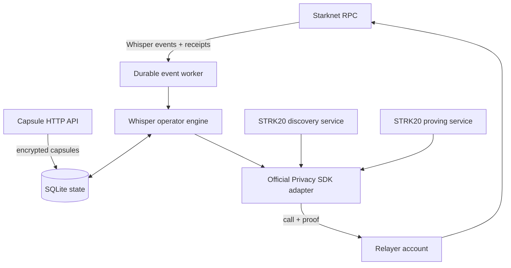

# Operator architecture

The operator is a backend-controlled STRK20 privacy account plus a durable worker. It is the only component allowed to see the vault viewing key and the only party able to spend auction escrow notes. Bidder proofs are produced by the bidder's compatible wallet and never pass through this service.

## Component map



## Source layout

| Module | Responsibility |
|---|---|
| `operator/src/starknet-chain.ts` | Reads auction/bid state, scans Whisper events, extracts pool `EncNoteCreated` IDs from receipts |
| `operator/src/worker.ts` | Maintains the durable block cursor, retries submissions, recovers stale leases, schedules settlement |
| `operator/src/engine.ts` | Matches notes, validates capsules, accepts tranches, aggregates bid groups, and constructs Vickrey settlement plans |
| `operator/src/strk20-vault.ts` | Adapts official SDK discovery/builders and submits proof-backed pool calls |
| `operator/src/official-sdk.ts` | Constructs `createPrivateTransfers(...)` with injected providers and the vault's own key boundary |
| `operator/src/sqlite-store.ts` | Persists capsules, submissions, auctions, leases, cursor, and idempotency state |
| `operator/src/api.ts` | Exposes health, public vault configuration, and idempotent capsule upload endpoints |
| `operator/src/service.ts` | Assembles and validates the service without starting transactions automatically |

## Event scanning

The worker begins at the configured Whisper deployment block and scans bounded block windows for:

- `AuctionCreated`, to track auctions that will eventually need settlement; and
- `BidSubmitted`, to queue note correlation and acceptance.

After storing all events from a window, it advances a durable SQLite cursor. A restart continues from the saved block rather than rescanning the chain from genesis.

## Transaction-scoped note matching

For each `BidSubmitted`, the chain adapter loads its source transaction receipt and collects every `EncNoteCreated` event emitted by the configured pool.

Separately, the vault SDK discovers notes it can decrypt for the auction payment token. After authenticating and decrypting the capsule, the engine intersects these sets by note ID and committed amount:

```text
receipt note IDs
∩ notes decryptable by this vault
∩ notes for the auction token
∩ notes matching the capsule amount
```

The result must become exactly one before the acceptance deadline:

- **zero:** discovery may be lagging, so keep the job retryable;
- **one:** validate and accept the matching bid note;
- **more than one:** reject the submission as ambiguous.

Other transaction outputs, such as private change, do not make the bid ambiguous when their amounts differ. This makes no claim that the pool itself understands an auction. `AcceptBid` is the operator's explicit attestation that the discovered note matches the committed bid.

`AcceptBid` must share its proof batch with a replay-protecting private state transition. The Sepolia pool rejected a callback-only proof as `NO_REPLAY_PROTECTION`; the operator consumes and reissues the oldest mature vault-originated replay note in the same proof batch. It excludes the current escrow note and notes sent by other accounts, leaving the bid note available for settlement. Acceptance is serialized within one process, and readiness fails when no eligible replay note is available.

A newly reissued baton needs discovery and proof-block maturity before reuse, so operators should provision several small replay notes for bursts and run one scheduler per vault/database. Multi-process replay-note leasing is not implemented.

## Capsule validation

The encrypted capsule is addressed by `reveal_commitment`. After decryption, the engine checks:

1. the capsule's auction ID;
2. its refund and winner commitments;
3. the full reveal commitment hash;
4. the vault note amount;
5. the auction reserve; and
6. the acceptance deadline.

No bid is accepted unless capsule authentication and every note/commitment check succeed. Commitment mismatches, wrong amounts, closed acceptance windows, and ambiguous notes are rejected; missing capsules, temporary key-provider errors, and discovery lag remain retryable.

## Durable work and idempotency

Submissions move through:

```text
received → accepting → funded
         ↘ retry
         ↘ rejected
```

Settlements move through:

```text
pending/retry → settling → settled
```

Claims use atomic SQLite updates so two loops cannot submit the same action simultaneously. If a process dies while holding an `accepting` or `settling` lease, the next worker run recovers it to `retry` after the stale threshold.

Before resubmitting, the engine reconciles public onchain state. If the bid or auction already completed, it records that result locally instead of performing the action twice.

## SDK and proving boundary

There are two distinct proving boundaries:

- **Bidder:** the dapp supplies standard `transfer` + `invoke` actions to `strk20InvokeTransaction(actions)`. The wallet owns the bidder's notes and proof generation.
- **Operator:** this backend directly composes the Privacy SDK for vault acceptance, settlement, abort, and vault maintenance.

The official SDK instance is composed with:

```text
vault account address + signer
vault viewing-key provider
proving service URL + chain + RPC
discovery service URL
canonical pool address
```

The SDK discovers notes and builds a pool `callAndProof`. A separate relayer account wraps and submits it using outside execution with the required `proofFacts` and proof data.

The relayer does not need the vault viewing key. It receives an already-built invocation and pays/submits the transaction.

## Secret boundaries

Four credentials enter through injected providers:

| Credential | Capability |
|---|---|
| Vault Starknet signer | Authorizes proof invocations for the vault account |
| Vault viewing key | Discovers notes and derives private pool state |
| Capsule reveal private key | Opens Whisper's application-layer bid payloads |
| Relayer signer | Submits outside-execution transactions and pays gas |

They are not fields in the public runtime config and are not persisted in SQLite. A production process should obtain them from a deployment secret manager and avoid logging SDK objects that may contain decrypted notes.

The backend handles only its own vault keys. It must never request or store a bidder's viewing key.

## Startup is deliberately non-transactional

`createOperatorService(...)` assembles the components. `validate()` checks:

- the vault account address;
- RPC chain ID;
- viewing-key-derived public key;
- reveal-key-derived public key; and
- the pool address configured by the deployed Whisper contract.

Only after validation should the caller start `listen()` and `worker.run(signal)`. Vault registration is a separate explicit `registerVault()` action so a restart cannot accidentally create an onchain transaction.

## Scheduling settlement

Each worker pass loads all tracked auctions:

- while a start-on-bid auction is `Pending`, it waits for the first submission;
- before `force_reveal_after`, it waits;
- from `force_reveal_after` until `abort_after`, it attempts settlement; and
- after `abort_after`, normal settlement is no longer submitted.

Production still needs alerting well before the abort deadline, recovery automation, database backups, and a single scheduler leader per database.

For the operator's authority and failure modes, continue to [Privacy & trust](/security/privacy-and-trust).
