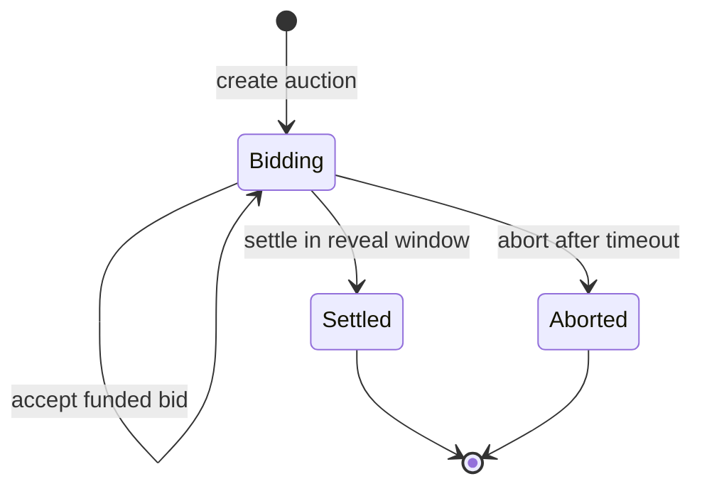
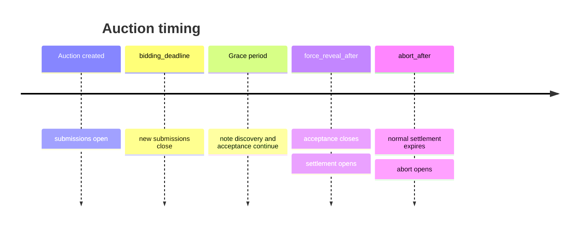

# Bid lifecycle

Whisper separates **submission** from **funding**. A private identity can submit a commitment, but the bid only enters the auction after the operator has matched and validated its escrow note.

## Auction state



`Settled` and `Aborted` are terminal. The contract does not have a bidder-driven reclaim state because bidders do not own the vault notes after transferring them.

## Bid state

Each stored bid contains:

| Field | Purpose |
|---|---|
| `auction_id` | Domain separation and lookup |
| `bid_handle` | Deterministic public bid identifier and tie-breaker |
| `identity_commitment` | Enforces one bid per private identity per auction |
| `note_id` | Identifies the accepted vault note; zero before funding |
| `reveal_commitment` | Commits to amount, salt, refund route, and winner payload |
| `refund_commitment` | Commits to the private refund recipient |
| `winner_commitment` | Opaque application-defined winner payload |
| `submitted_at` | Public timestamp |
| `funded` | Whether the operator accepted matching escrow |
| `settled` | Whether included in terminal settlement |

## Submission

The bidder's private action calls `PrivacyRequest::SubmitBid` with:

```text
auction_id
reveal_commitment
refund_commitment
winner_commitment
```

The pool supplies a contract-scoped identity key to Whisper's private computation. Whisper derives `identity_commitment` and `bid_handle`, rejects a duplicate identity, stores the bid as unfunded, and emits `BidSubmitted`.

No maximum bid appears in that request.

## Funding acceptance

After finding one matching note, the operator calls `PrivacyRequest::AcceptBid` with:

```text
auction_id
bid_handle
note_id
```

Whisper verifies the operator's private identity commitment, that the auction is accepting notes, that the note ID has not funded another bid, and that the bid is not already funded. The contract then appends the handle to its ordered accepted set.

The ordered set has a rolling `accepted_bids_hash`. Settlement must use that same order and hash, which prevents the operator from quietly omitting or reordering funded bids in the claimed result.

## Deadlines and grace period



The grace period must be long enough for the submitted transaction to be indexed and for the note to become usable in the eventual settlement. A zero-match discovery result is treated as retryable before the acceptance deadline; multiple matching vault notes in one submission transaction are rejected as ambiguous.

## Force reveal

The current implementation uses one operator, so “force reveal” means the service can reveal every funded bid without waiting for bidder cooperation. It is not a threshold committee and it is not a bidder-side commit/reveal transaction.

During settlement, the operator sends every accepted opening:

```text
(bid_handle, amount, salt)
```

Whisper recomputes each `reveal_commitment`. A missing, reordered, or invalid opening fails the transaction.

## Winner selection

The winner is the bid with:

1. the greatest amount; then
2. the smallest `bid_handle` when amounts tie.

The clearing price is:

```text
max(reserve_price, second_highest_bid)
```

Special cases:

- **No funded bids:** no winner and zero clearing price.
- **One funded bid:** the bidder pays the reserve.
- **Tied highest bids:** the smallest handle wins and pays the tied amount.

## Settlement outputs

For every funded bid, the operator already controls an exact-value vault note. It builds:

- one full refund note for each loser;
- one change note for the winner when `winning_bid > clearing_price`; and
- one proceeds note for the seller worth `clearing_price`.

Zero-value change is omitted. The pool proves that all consumed notes equal all created notes for the payment token.

## Winner commitment

Whisper deliberately does not define the prize. `winner_commitment` can represent:

- the private identity allowed to control a game role;
- a delivery or claim key for an NFT marketplace;
- a blinded account chosen by an allocation mechanism; or
- any application-specific payload with its own domain rules.

The consumer decides how to verify or redeem that commitment. Whisper only publishes the commitment belonging to the verified winning bid.

## Abort and recovery

After `abort_after`, the operator can submit `PrivacyRequest::Abort` with a non-zero `recovery_hash`. This records a commitment to an external recovery or refund manifest.

It does **not** move funds and does not let bidders reclaim vault notes. The same operator still has to construct private refunds. This is an operational recovery marker, not a cryptographic escape hatch.

For how these calls are generated and scheduled, continue to [Operator architecture](/architecture/operator).
