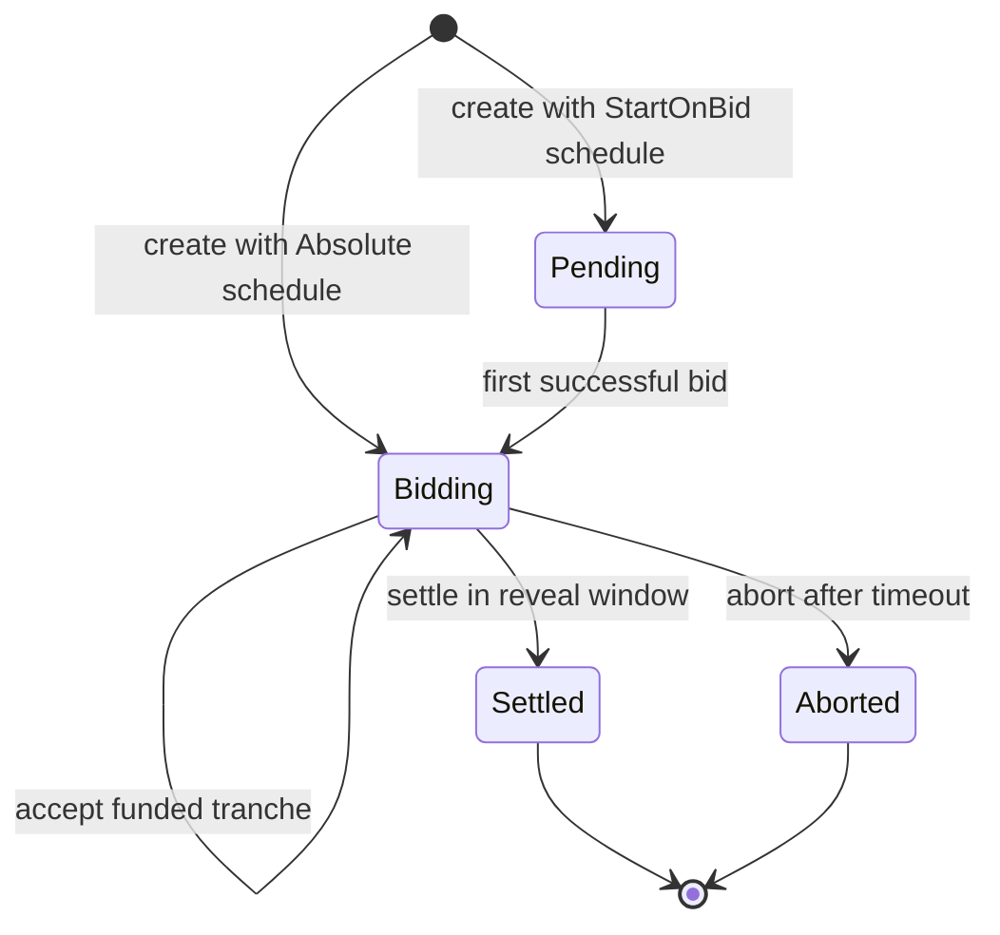
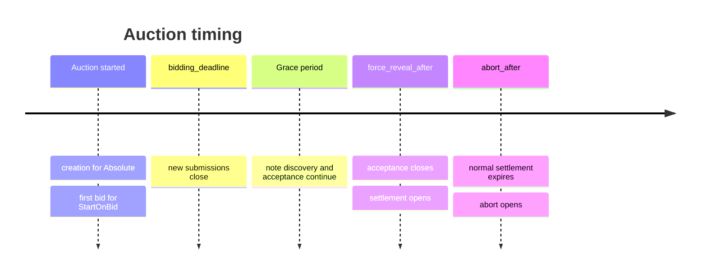

# Bid lifecycle

Whisper separates **submission** from **funding**. A wallet can atomically transfer a private note and submit its commitment, but the tranche only enters the auction after the operator has matched and validated the escrow note.

## Auction state



`Pending` means a start-on-bid auction has not received its first bid and has no resolved deadlines yet. `Settled` and `Aborted` are terminal. The contract does not have a bidder-driven reclaim state because bidders do not own the vault notes after transferring them.

## Bid state

Each stored tranche contains:

| Field | Purpose |
|---|---|
| `auction_id` | Domain separation and lookup |
| `bid_handle` | Deterministic public tranche identifier |
| `group_handle` | Links additive tranches into one logical bid and acts as the tie-breaker |
| `tranche_index` | Position within the logical bid group |
| `note_id` | Identifies the accepted vault note; zero before funding |
| `reveal_commitment` | Commits to amount, salt, refund route, and winner payload |
| `refund_commitment` | Commits to the private refund recipient |
| `winner_commitment` | Opaque application-defined winner payload |
| `submitted_at` | Public timestamp |
| `funded` | Whether the operator accepted matching escrow |
| `settled` | Whether included in terminal settlement |

## Submission

The SDK returns two standard Wallet API actions:

```text
transfer(payment_token, amount, vault_address)
invoke(whisper_address, WalletBidRequest::SubmitBid(...))
```

The initial request contains:

```text
auction_id
bid_nonce
reveal_commitment
refund_commitment
winner_commitment
```

The dapp passes both actions to `strk20InvokeTransaction(actions)`. The compatible wallet selects private inputs, generates the proof, and relays the atomic pool transaction. For a pending start-on-bid auction, this successful transaction first resolves the deadlines and emits `AuctionStarted`. Whisper then derives a random-nonce-based `group_handle` and its first `bid_handle`, stores the tranche as unfunded, and emits `BidSubmitted`.

No maximum bid appears in that request.

## Increasing a bid

An increase transfers another exact-value encrypted note and invokes `WalletBidRequest::AddBidTranche` with the existing group handle and a fresh reveal commitment. If a bidder first transfers 50 and later transfers 30, settlement treats the group as one 80-token bid.

Increases are additive. They cannot replace, cancel, or reduce earlier tranches. The public can see that a group received another tranche and when it happened, but not the tranche amount or bidder wallet.

## Funding acceptance

After finding one matching note, the operator calls `PrivacyRequest::AcceptBid` with:

```text
auction_id
bid_handle
note_id
```

Whisper verifies the operator's private identity commitment, that the auction is accepting notes, that the note ID has not funded another tranche, and that the tranche is not already funded. The contract then appends the tranche handle to its ordered accepted set. Auction `max_bids` currently limits accepted tranches, not unique groups.

The ordered set has a rolling `accepted_bids_hash`. Settlement must use that same order and hash, which prevents the operator from quietly omitting or reordering funded tranches in the claimed result.

## Deadlines and grace period

Creation selects one of two schedule variants:

| Schedule | Configuration | Initial state |
|---|---|---|
| `Absolute` | Three absolute chain timestamps | `Bidding`; `started_at` is creation time |
| `StartOnBid` | Bidding, acceptance, and settlement durations | `Pending`; `started_at` and resolved deadlines are zero |

On the first successful bid, `StartOnBid` uses the bid transaction's block timestamp as `started_at`. It adds `bidding_duration`, then `acceptance_duration`, then `settlement_duration` to derive the public deadlines. Later bids never extend them.



The grace period must be long enough for the submitted transaction to be indexed and for the note to become usable in the eventual settlement. A zero-match discovery result is treated as retryable before the acceptance deadline; multiple matching vault notes in one submission transaction are rejected as ambiguous.

A pending auction cannot settle, abort, or release an escrowed asset. There is no creator-cancel path yet, so an escrowed lot remains locked if a start-on-bid auction never receives a bid.

## Force reveal

The current implementation uses one operator, so “force reveal” means the service can reveal every funded tranche without waiting for bidder cooperation. It is not a threshold committee and it is not a bidder-side commit/reveal transaction.

During settlement, the operator sends every accepted tranche opening:

```text
(bid_handle, amount, salt)
```

Whisper recomputes each `reveal_commitment`. A missing, reordered, or invalid opening fails the transaction. It then sums valid tranche amounts by `group_handle` before pricing.

## Winner selection

The winner is the bid with:

1. the greatest aggregate amount at or above the reserve; then
2. the smallest `group_handle` when aggregate amounts tie.

The clearing price is:

```text
max(reserve_price, second_highest_bid)
```

Special cases:

- **No funded tranches:** no winner and zero clearing price.
- **Only groups below reserve:** no winner and every group is fully refunded.
- **One eligible funded group:** the bidder pays the reserve.
- **Tied highest groups:** the smallest group handle wins and pays the tied amount.

## Settlement outputs

For every funded tranche, the operator controls an exact-value vault note. It builds:

- one combined refund note for each losing group;
- one change note for the winner when `winning_bid > clearing_price`; and
- one proceeds note for the seller worth `clearing_price`.

Zero-value change is omitted. The pool proves that all consumed notes equal all created notes for the payment token.

## Winner commitment

Whisper deliberately does not define the prize. `winner_commitment` can represent:

- the private identity allowed to control a game role;
- a delivery or claim key for an NFT marketplace;
- a blinded account chosen by an allocation mechanism; or
- any application-specific payload with its own domain rules.

The consumer decides how to verify or redeem that commitment. Whisper only publishes the commitment belonging to the verified winning bid.

Stake Wars selects the explicit `Offchain` kind for controller fulfillment. ERC-20, ERC-721, and ERC-1155 auctions select the matching kind in the same creation interface; Whisper deposits the token before opening the auction and verifies a domain-separated recipient/secret opening after settlement. See [Auction fulfillment](/auctions/fulfillment).

## Abort and recovery

After `abort_after`, the operator can submit `PrivacyRequest::Abort` with a non-zero `recovery_hash`. This records a commitment to an external recovery or refund manifest.

It does **not** move funds and does not let bidders reclaim vault notes. The same operator still has to construct private refunds. This is an operational recovery marker, not a cryptographic escape hatch.

For how these calls are generated and scheduled, continue to [Operator architecture](/architecture/operator).
