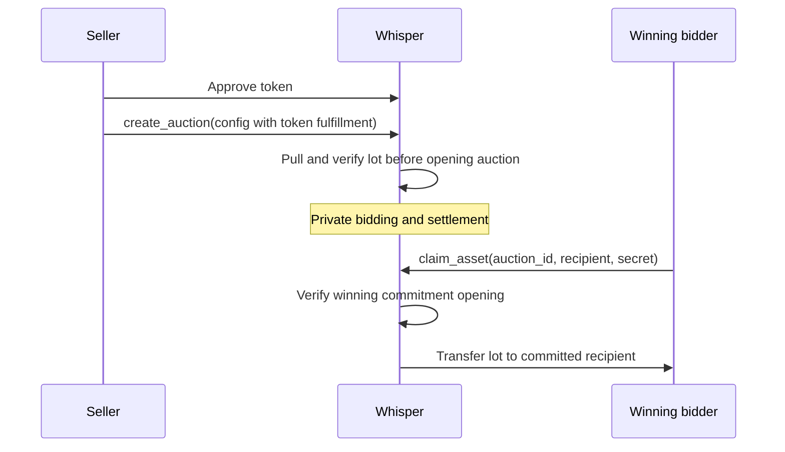

# Auction fulfillment

Every auction explicitly selects one fulfillment kind: `Offchain`, `Erc20`, `Erc721`, or `Erc1155`. Price discovery and the winning commitment remain generic, while the fulfillment kind determines whether delivery stays in an application or is enforced by `WhisperAuction`.

## Offchain fulfillment

Stake Wars sets `AuctionConfig.fulfillment` to `Offchain` and all token fields to zero. Its `metadata_hash` identifies the controller opportunity, and its application-defined `winner_payload_domain` tells the arbiter how to interpret the winning commitment. The Stake Wars API rejects a configured round if its onchain auction is not explicitly offchain.

This path also fits game roles, service allocations, physical goods, and other rights whose delivery is handled by an application or arbiter. Whisper proves the Vickrey result, but the fulfillment consumer defines and enforces delivery.

## Token escrow

For an ERC-20 amount, one ERC-721 token, or an ERC-1155 token and quantity, the seller approves `WhisperAuction` and calls the same `create_auction` entrypoint with the token descriptor.

The descriptor is part of stored auction state, so no adapter address or special metadata commitment is needed. ERC-20 uses an amount and token ID zero, ERC-721 uses a token ID with amount one, and ERC-1155 uses a token ID plus quantity. Token auctions must use `WHISPER_ASSET_WINNER_V1` as their winner-payload domain.

The winning bidder computes `winner_commitment` with `computeAssetWinnerCommitment`, binding the Whisper contract, auction ID, recipient, and a private secret. Anyone may relay the later claim, but changing the recipient invalidates the opening, so front-running cannot redirect the lot.

## Returns and terminal states

| Whisper state | Escrow result |
|---|---|
| Settled with winner | Only the committed recipient can receive the lot; no seller clawback |
| Settled without winner | Lot is returnable to the auction creator |
| Aborted | Lot is returnable to the auction creator |
| Still bidding at or after `abort_after` | Lot is returnable because normal settlement has expired |

Winning lots remain claimable indefinitely. This avoids a race in which the seller could reclaim an already-won asset before the winner appears.

## Trust boundary

Token escrow prevents a seller from refusing onchain delivery after settlement. It does not make the current private payment path trustless: the 1-of-1 operator still controls bid notes and the actual private settlement outputs are not cryptographically bound to Whisper's `outputs_root`.

The lot, seller, token ID or quantity, deposit, and eventual public recipient are visible onchain. STRK20 hides the bid-side transfer details described in [Privacy & trust](/security/privacy-and-trust), not the public asset escrow. The integrated escrow is experimental and requires independent Cairo review before meaningful use.
