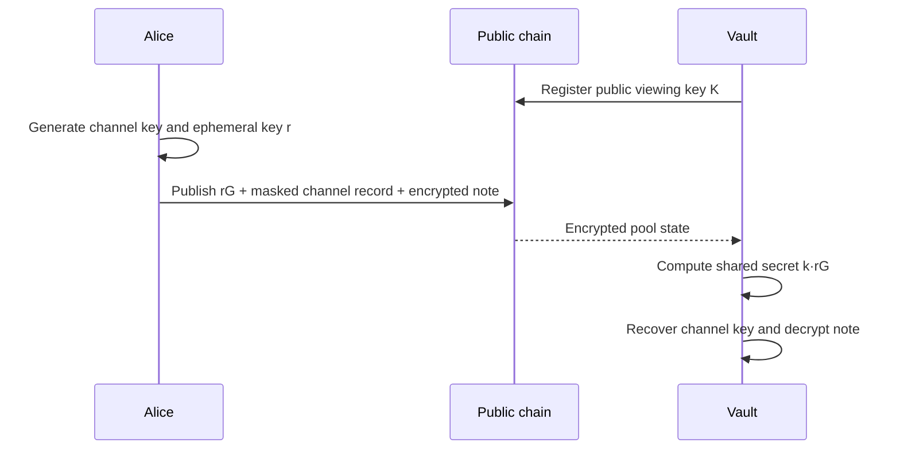
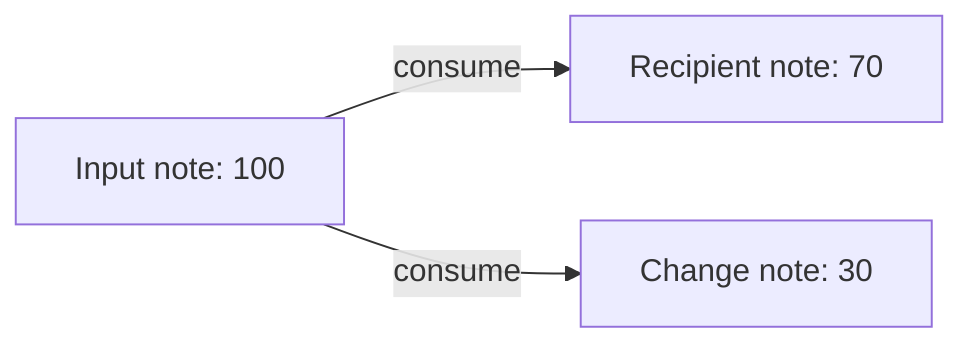

# Encrypted notes

An STRK20 note is a UTXO: an immutable piece of private balance that is consumed all at once. Logically, it records an owner, ERC-20 token, and amount, while its onchain location and payload are derived or encrypted so ordinary observers cannot read the payment relationship.

## A note does have a receiver

The receiver is selected **cryptographically**, not written as an obvious plaintext “to” field.

Every privacy account has a viewing keypair:

| Key | Visibility | Purpose |
|---|---|---|
| Private viewing key | Secret to the account owner | Discover and decrypt notes, derive channels and nullifiers |
| Public viewing key | Registered onchain | Let senders encrypt channels and notes to this account |

When Alice pays the Whisper vault, Alice uses the vault's registered public viewing key to establish a directional Alice → vault channel. Only Alice and the vault can derive its channel key. The vault later uses its private viewing key to discover and decrypt notes in that channel.



An observer sees that the pool changed and sees opaque storage/event values. They do not get the clear sender → receiver → amount tuple of an ordinary ERC-20 transfer.

## Channels make private discovery possible

There is no global private-payment inbox. Notes live inside directional channels:

```text
sender → recipient channel
  ├── token subchannel A
  │   ├── note 0
  │   └── note 1
  └── token subchannel B
      └── note 0
```

Each token has its own subchannel and each note has a dense sequential index. The note ID is derived from the secret channel key, token, and index. Without the channel key, its storage location looks random.

This is why the receiver is already determined even though outsiders cannot read it: the correct private key is what makes the channel and note discoverable.

## Shielding is a self → self channel

Shielding moves a public ERC-20 into the pool and creates a private note for the same account. Internally, that is a self-channel:

```text
Alice public ERC-20 balance
  → public pool deposit
  → Alice → Alice channel
  → encrypted note owned by Alice
```

The deposit amount and depositing address are public because the ERC-20 leg is public. The resulting private note can later fund a separate private transfer.

Shielding and bidding in one transaction is convenient but weakens privacy: the public deposit appears beside the private output it funds, making timing and amount correlation trivial. Whisper assumes bidders shield earlier and bid later from an existing private balance.

## Notes are spent, not edited

A 100-token note cannot be reduced in place. Paying 70 consumes it and creates new outputs:



The pool requires the per-token balance to end at zero. A zero-knowledge proof shows that the input belongs to the spender and that inputs equal outputs without revealing the encrypted values to ordinary observers.

## Nullifiers prevent double spending

Spending does not erase the immutable note. Instead, the spender publishes a one-way nullifier derived from the note, channel, and owner's private viewing key.

- The same note always produces the same nullifier.
- The pool rejects a repeated nullifier.
- Without the viewing key, an observer cannot link the nullifier back to its note.
- Even the original sender cannot watch for the recipient spending it, because the sender lacks the recipient's private viewing key.

## Note IDs can be public without revealing note contents

The pool's `EncNoteCreated` event exposes a note ID. Whisper intentionally records each accepted note ID too, because it needs a durable handle connecting the funded tranche to the vault's later settlement input.

Knowing the ID does not by itself reveal the owner, token, amount, channel key, or eventual nullifier. Privacy still has side channels: unique amounts, closely timed public shielding, or outside knowledge can make a payment easier to correlate.

## Discovery is a read operation

The vault discovers notes by scanning encrypted channel records and trying to decrypt those addressed to it. For each channel, it walks token subchannels and note indices, decrypts the token and amount, and checks the nullifier set to remove spent notes.

The operator uses the official SDK's `discoverNotes({ tokens: [...] })` flow. Discovery creates no proof and no onchain transaction; it requires access to the vault's private viewing key.

## Why Whisper also needs a reveal capsule

An STRK20 note carries private value, not arbitrary application messages. Whisper needs extra auction data that the note format does not contain:

- the commitment salt;
- the private refund destination;
- the winner payload;
- the auction ID binding; and
- enough authenticated context to prevent replay.

Whisper therefore uses two encryption layers:

| Object | Encrypted to | Carries | Used for |
|---|---|---|---|
| STRK20 note | Vault viewing key/channel | Token and actual bid amount | Escrow and settlement value |
| Whisper capsule | Separate reveal public key | Amount, salt, refund routing, winner commitment | Validate and open the bid transcript |

The amount appears in both and must match. That equality is one of the operator's acceptance checks.

## Open notes are different

An open note deliberately leaves its token and amount public so a DeFi contract can fill an output amount that was unknown when the proof was created. Ownership remains private. Whisper bids use encrypted exact-value notes, not open notes, because hiding the maximum bid before settlement is the point.

Read the underlying protocol guides on [notes and nullifiers](https://strk20-by-example.org/notes-and-nullifiers), [viewing keys](https://strk20-by-example.org/viewing-keys), [channels](https://strk20-by-example.org/channels-and-subchannels), and [note discovery](https://strk20-by-example.org/sdk/note-discovery).
