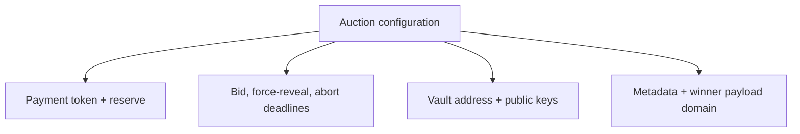
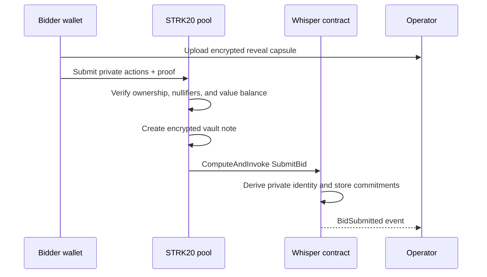
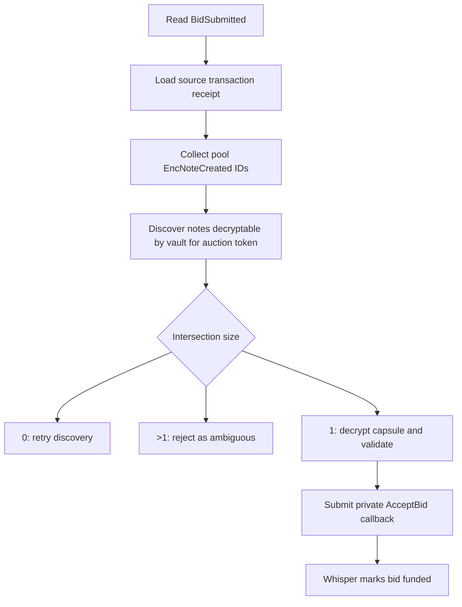

# How Whisper works

This page follows one bid from a bidder's private balance into the auction vault and then through settlement. The most important distinction is that **the STRK20 pool owns the privacy mechanics, the Whisper contract owns the auction rules, and the operator owns the vault keys**.

## 1. The pieces

| Component | What it knows | What it does |
|---|---|---|
| Bidder wallet/privacy account | Its own viewing key, notes, bid, refund destination | Creates the bid note, capsule, commitments, and proof-backed transaction |
| Canonical STRK20 pool | Public actions, encrypted storage, nullifiers, proof facts | Verifies note ownership and value conservation; writes notes; invokes Whisper |
| Whisper Cairo contract | Public configuration, handles, commitments, accepted set, revealed settlement | Enforces deadlines, uniqueness, commitment openings, and Vickrey pricing |
| Operator vault | Its own viewing key, received notes, decrypted capsules | Validates incoming escrow, accepts funded bids, and creates settlement outputs |
| Relayer | The already-built call and proof | Pays gas and submits the pool transaction without needing private note data |

The Whisper Cairo contract is **not** the private vault. Current STRK20 notes are owned and spent by a registered privacy account, so the first version uses a backend-controlled vault account.

## 2. Before anyone bids

### The pool already exists

Whisper targets the canonical STRK20 pool. It does not deploy a pool per auction, and the pool does not know what a Vickrey auction is.

### The vault registers once

The operator vault has:

- a Starknet account signer;
- a private STRK20 viewing key;
- a registered public viewing key that lets bidders encrypt notes to it; and
- a separate Whisper reveal keypair for application-layer bid capsules.

The viewing key and reveal key are intentionally different. The first controls pool discovery and note spending. The second decrypts the auction payload that the standard note format does not carry.

### The auction publishes immutable configuration

An auction fixes its payment token, reserve, capacity, three deadlines, vault address, vault public key, reveal public key, operator identity commitment, seller commitment, metadata hash, and winner-payload domain.



## 3. The bidder prepares two encrypted objects

Whisper uses two objects because they solve different problems.

### A. The STRK20 bid note

The bid note is actual escrowed value. Logically it contains:

```text
owner  = operator vault
token  = auction payment token
amount = bidder's maximum bid
```

The pool stores it at a cryptographically derived note ID. The owner, token, and amount are recoverable by the intended recipient's viewing key, but are not readable by a normal chain observer.

### B. The Whisper reveal capsule

The standard pool note is not a general-purpose encrypted message. Whisper therefore creates a second authenticated ciphertext containing:

```text
auction_id
amount
salt
refund_recipient
refund_commitment
winner_commitment
```

The SDK seals this capsule to the auction's `reveal_public_key` using Stark-curve ECDH, HKDF-SHA256, and AES-256-GCM. Its authenticated context binds it to the chain, pool, Whisper deployment, auction, and reveal commitment, preventing a valid capsule from being replayed into another auction or deployment.

The capsule is uploaded to the operator service. It is not public settlement calldata.

## 4. Commitments replace plaintext bid data

The onchain submission carries commitments rather than the bid amount:

```text
identity_commitment = Poseidon(
  "WHISPER_ID_V1",
  contract_scoped_identity_key,
  auction_id
)

reveal_commitment = Poseidon(
  "WHISPER_REVEAL_V1",
  auction_id,
  amount,
  salt,
  refund_commitment,
  winner_commitment
)

bid_handle = Poseidon(
  "WHISPER_BID_V1",
  auction_id,
  identity_commitment,
  reveal_commitment,
  refund_commitment,
  winner_commitment
)
```

The contract-scoped identity prevents the same private identity from submitting twice to one auction without publishing the bidder's normal wallet address. Fresh salts and routing commitments prevent accidental cross-auction linkage.

## 5. Transfer and submission happen atomically

The client builds one STRK20 private operation batch:

1. Spend the bidder's existing private input note or notes.
2. Create an encrypted output note worth exactly the maximum bid for the vault.
3. Return any excess input as private change.
4. Add one `ComputeAndInvoke` action containing the public bid commitments.



Putting the note output and `SubmitBid` callback in the same transaction lets the operator correlate them by transaction receipt. It is not an auction-specific proof that the note belongs to that bid; the operator performs that binding when it accepts the bid.

## 6. The bid starts as submitted, not funded

Whisper records a new bid with `funded = false`. This two-step state is important: the contract has seen a valid private identity and commitment transcript, but it cannot decrypt the vault note or verify the note amount itself.

The `BidSubmitted` event exposes:

- `auction_id`;
- `bid_handle`;
- the source transaction hash and block through the Starknet event envelope; and
- a submission index.

It does not expose the bid amount or salt.

## 7. The operator discovers and accepts the note

The operator processes the submission as follows:



For the one matching note, the operator checks:

- the note belongs to its vault discovery set;
- the note token equals the auction token;
- the note amount equals the capsule amount;
- the capsule opens `reveal_commitment`;
- refund and winner commitments match the submission;
- the amount meets the reserve; and
- acceptance is still before `force_reveal_after`.

The operator then sends `PrivacyRequest::AcceptBid` through the pool. Whisper authenticates the operator's contract-scoped private identity, records the note ID, appends the bid to the ordered accepted set, and sets `funded = true`.

Only funded bids participate in settlement.

## 8. The three deadlines

| Deadline | Meaning |
|---|---|
| `bidding_deadline` | No new bid submissions after this time |
| `force_reveal_after` | Note acceptance is closed; the operator must settle by opening all funded bids |
| `abort_after` | Normal settlement has expired; the operator may record an abort/recovery commitment |

The gap between bidding and force reveal is an acceptance grace period. It gives the discovery indexer time to expose notes submitted near the bidding deadline.

“Force reveal” does not mean every bidder must return and reveal. The 1-of-1 operator already holds encrypted capsules and vault notes, so it can complete settlement without another bidder transaction.

## 9. Settlement is one private batch

During the settlement window, the operator:

1. Loads the complete ordered set of funded bids.
2. Discovers every accepted vault note.
3. Decrypts every capsule and revalidates it against the note and commitments.
4. Computes the winner and Vickrey price.
5. Builds private outputs for losers, winner change, and seller proceeds.
6. Spends the accepted notes and creates all outputs in one pool batch.
7. Adds `PrivacyRequest::Settle` as the batch's `ComputeAndInvoke` action.

The pool proves that all input notes are owned by the vault, have not been spent, and balance exactly against all outputs. Whisper independently verifies the public settlement transcript and Vickrey result.

## 10. Vickrey pricing by example

Suppose the reserve is 50 and three accepted maximum bids are:

| Bid handle | Maximum bid | Result |
|---|---:|---|
| `10` | 100 | Wins |
| `20` | 80 | Loses |
| `30` | 70 | Loses |

The clearing price is:

```text
max(reserve, second_highest_bid)
= max(50, 80)
= 80
```

The private outputs are:

| Output | Amount |
|---|---:|
| Winner change | 20 |
| Bidder `20` refund | 80 |
| Bidder `30` refund | 70 |
| Seller proceeds | 80 |

Inputs total 250 and outputs total 250. The pool proves conservation without learning the private recipients. The settlement calldata publishes the accepted amounts and clearing result in the current protocol.

With one valid bid, the winner pays the reserve. With no funded bids, the auction settles without a winner. A tie is broken by the smallest `bid_handle`, and the clearing price equals the tied amount.

## 11. What each layer actually proves

| Claim | Enforced by |
|---|---|
| Spent notes exist and belong to the spender | STRK20 proof and account signature |
| A note cannot be spent twice | Pool nullifier set |
| Private inputs and outputs conserve each token | STRK20 pool |
| Only the configured pool invokes Whisper's private state path | Whisper contract |
| One auction-scoped identity submits at most once | Pool-derived identity + Whisper contract |
| Every revealed amount opens its original commitment | Whisper contract |
| Winner, tie-break, and second price are correct | Whisper contract |
| The incoming note corresponds to the capsule and bid | Operator attestation |
| Refund and proceeds note recipients match the advertised output root | Operator attestation in the current design |

That last distinction is the main trust boundary. Whisper verifies the claimed output root, but the canonical pool has no auction-specific rule tying its encrypted output notes to Whisper's routing commitments.

## 12. Why losers do not need to reclaim

In the normal path, losing bidders do nothing after bidding. The operator's settlement consumes their escrow notes and creates new encrypted notes at their committed refund destinations.

This matches Web2 auction ergonomics, but it is not a permissionless reclaim path. Because the vault account owns the escrow notes, an unavailable or malicious operator can delay, withhold, or redirect funds. `Abort` records a recovery commitment; it does not let bidders spend the vault's notes themselves.

## 13. The shortest accurate summary

Whisper privately transfers each maximum bid into an operator-owned STRK20 vault, publicly commits to the auction transcript, lets the operator attest which encrypted note funded which bid, and later combines ordinary private note spending with a Cairo-verified Vickrey settlement.

Next, read [Encrypted notes](/concepts/encrypted-notes) for the cryptographic receiver model or [Privacy & trust](/security/privacy-and-trust) for the custody trade-off.
