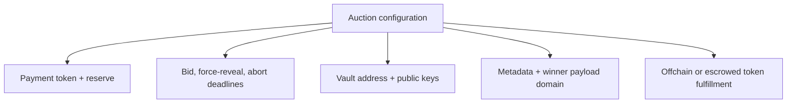
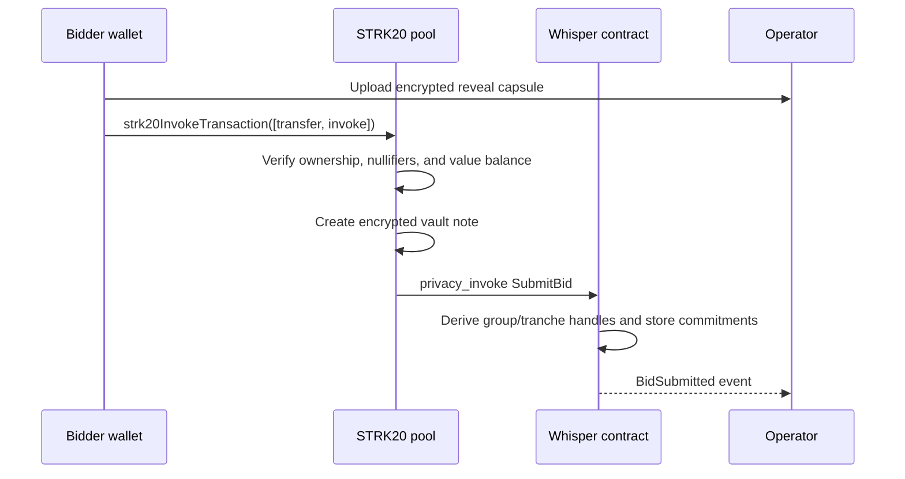
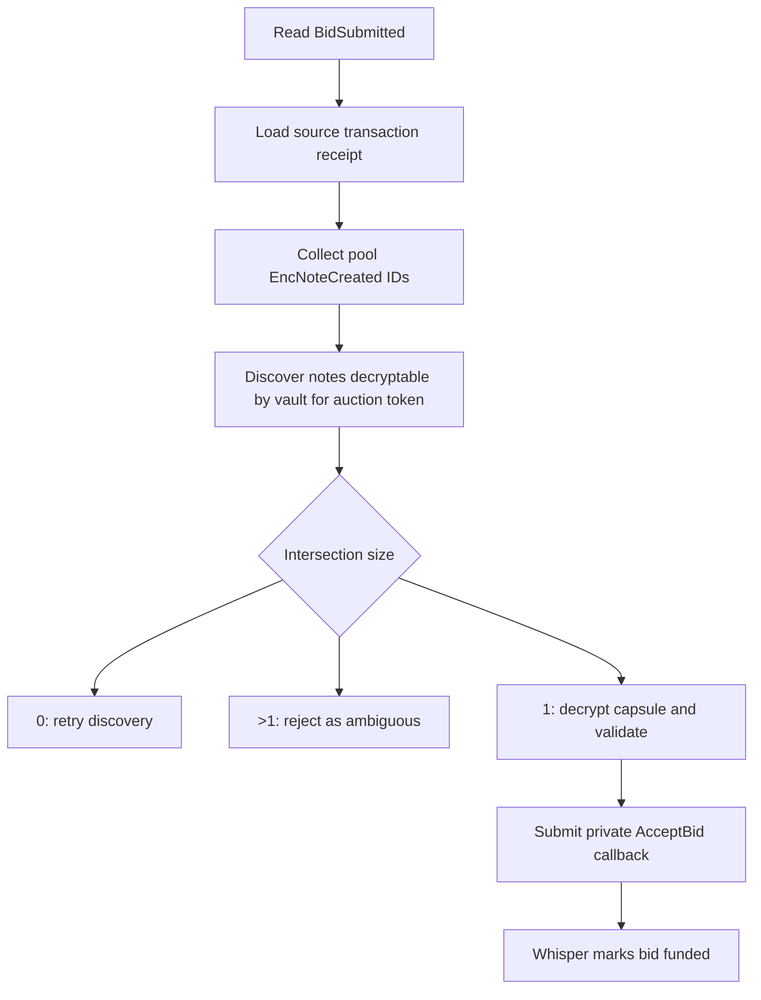

# How Whisper works

This page follows one bid from a bidder's private balance into the auction vault and then through settlement. The most important distinction is that **the STRK20 pool owns the privacy mechanics, the Whisper contract owns the auction rules, and the operator owns the vault keys**.

## 1. The pieces

| Component | What it knows | What it does |
|---|---|---|
| Bidder wallet/privacy account | Its own viewing key, notes, bid, refund destination | Executes the dapp's transfer + invoke actions and creates the proof-backed transaction |
| Canonical STRK20 pool | Public actions, encrypted storage, nullifiers, proof facts | Verifies note ownership and value conservation; writes notes; invokes Whisper |
| Whisper Cairo contract | Public configuration, handles, commitments, accepted set, revealed settlement | Enforces deadlines, uniqueness, commitment openings, and Vickrey pricing |
| Operator vault | Its own viewing key, received notes, decrypted capsules | Validates incoming escrow, accepts funded tranches, and creates settlement outputs |
| Relayer | The already-built call and proof | Pays gas and submits the pool transaction without needing private note data |
| Fulfillment path | Winning commitment and explicit fulfillment descriptor | Lets an application award an offchain right or makes Whisper release an escrowed token lot |

The Whisper Cairo contract is **not** the private vault. Current STRK20 notes are owned and spent by a registered privacy account, so the first version uses a backend-controlled vault account.

## 2. Before anyone bids

### The pool already exists

Whisper targets the canonical STRK20 pool. It does not deploy a pool per auction, and the pool does not know what a Vickrey auction is.

### The vault registers once

The operator vault has:

- a Starknet account signer;
- a private STRK20 viewing key;
- a registered public viewing key that lets bidders encrypt notes to it; and
- a separate Whisper reveal keypair for application-layer bid capsules.

The viewing key and reveal key are intentionally different. The first controls pool discovery and note spending. The second decrypts the auction payload that the standard note format does not carry.

### The auction publishes immutable configuration

An auction fixes its payment token, reserve, capacity, three deadlines, vault address, vault public key, reveal public key, operator identity commitment, seller commitment, metadata hash, winner-payload domain, and explicit fulfillment descriptor. Stake Wars uses the `Offchain` kind; an ERC-20/721/1155 seller approves Whisper and selects the matching token kind so the lot is deposited before bidding opens.



## 3. The dapp and wallet prepare two encrypted objects

Whisper uses two objects because they solve different problems.

### A. The STRK20 bid note

The bid note is actual escrowed value. Logically it contains:

```text
owner  = operator vault
token  = auction payment token
amount = bidder's maximum bid
```

The pool stores it at a cryptographically derived note ID. The owner, token, and amount are recoverable by the intended recipient's viewing key, but are not readable by a normal chain observer.

### B. The Whisper reveal capsule

The standard pool note is not a general-purpose encrypted message. Whisper therefore creates a second authenticated ciphertext containing:

```text
auction_id
amount
salt
refund_recipient
refund_commitment
winner_commitment
```

The SDK seals this capsule to the auction's `reveal_public_key` using Stark-curve ECDH, HKDF-SHA256, and AES-256-GCM. Its authenticated context binds it to the chain, pool, Whisper deployment, auction, and reveal commitment, preventing a valid capsule from being replayed into another auction or deployment.

The capsule is uploaded to the operator service. It is not public settlement calldata.

## 4. Commitments replace plaintext bid data

The onchain submission carries commitments rather than the bid amount:

```text
group_handle = Poseidon(
  "WHISPER_GROUP_V1",
  auction_id,
  bid_nonce,
  refund_commitment,
  winner_commitment
)

reveal_commitment = Poseidon(
  "WHISPER_REVEAL_V1",
  auction_id,
  amount,
  salt,
  refund_commitment,
  winner_commitment
)

bid_handle = Poseidon(
  "WHISPER_TRANCHE_V1",
  auction_id,
  group_handle,
  tranche_index,
  reveal_commitment
)
```

The random bid nonce makes the group handle unpredictable and independent of the bidder's wallet identity. A later additive tranche reuses the group handle, so the public can link increases to one logical bid even though its amount and owner remain hidden.

## 5. Transfer and submission happen atomically

The SDK builds one Wallet API action array:

1. A `transfer` action sends the exact tranche amount and token to the vault.
2. An `invoke` action calls Whisper's standard `privacy_invoke` entrypoint with the public commitments.

The dapp passes both actions to `strk20InvokeTransaction(actions)`. The wallet chooses private inputs, creates the vault output and any private change, generates the proof, and relays the transaction. The dapp never sees the viewing key, selected notes, or proof.



Putting the note output and `SubmitBid` callback in the same wallet transaction lets the operator correlate them by receipt. It is not an auction-specific proof that the note belongs to that bid; the operator performs that binding when it accepts the tranche.

## 6. The bid starts as submitted, not funded

Whisper records a new tranche with `funded = false`. This two-step state is important: the contract has seen a pool-originated callback and commitment transcript, but it cannot decrypt the vault note or verify the note amount itself.

The `BidSubmitted` event exposes:

- `auction_id`;
- `bid_handle`;
- `group_handle` and `tranche_index`;
- the source transaction hash and block through the Starknet event envelope; and
- a submission index.

It does not expose the bid amount or salt.

## 7. The operator discovers and accepts the note

The operator processes the submission as follows:



For the one matching note, the operator checks:

- the note belongs to its vault discovery set;
- the note token equals the auction token;
- the note amount equals the capsule amount;
- the capsule opens `reveal_commitment`;
- refund and winner commitments match the submission;
- the amount meets the reserve; and
- acceptance is still before `force_reveal_after`.

The operator then sends `PrivacyRequest::AcceptBid` through the pool. Whisper authenticates the operator's contract-scoped private identity, records the note ID, appends the tranche to the ordered accepted set, and sets `funded = true`.

Only funded tranches participate in settlement.

## 8. A bidder can increase without replacing

To increase a bid, the dapp creates a fresh amount opening and capsule, then calls `buildWhisperBidTopUpActions(...)`. The wallet again executes an atomic transfer + invoke, this time referencing the existing group handle.

The new note is a separate tranche. Settlement adds all funded tranche amounts in the group: 50 followed by 30 becomes one 80-token bid. Earlier tranches cannot be reduced or reclaimed before settlement, and the public can see the top-up link and timing even though it cannot see the amount.

## 9. Auction start and the three deadlines

The creator chooses an `Absolute` schedule with three chain timestamps or a `StartOnBid` schedule with bidding, acceptance, and settlement durations. Absolute auctions start at creation. Start-on-bid auctions remain `Pending` until the first successful bid atomically sets `started_at`, derives all three deadlines, and changes the status to `Bidding`. Later bids cannot extend the schedule.

| Deadline | Meaning |
|---|---|
| `bidding_deadline` | No new bid submissions after this time |
| `force_reveal_after` | Note acceptance is closed; the operator must settle by opening all funded tranches |
| `abort_after` | Normal settlement has expired; the operator may record an abort/recovery commitment |

The gap between bidding and force reveal is an acceptance grace period. It gives the discovery indexer time to expose notes submitted near the bidding deadline.

Before a start-on-bid auction begins, its resolved deadlines are zero and it cannot settle, abort, or release an escrowed lot. There is currently no creator-cancel path for a pending auction.

“Force reveal” does not mean every bidder must return and reveal. The 1-of-1 operator already holds encrypted capsules and vault notes, so it can complete settlement without another bidder transaction.

## 10. Settlement is one private batch

During the settlement window, the operator:

1. Loads the complete ordered set of funded tranches.
2. Discovers every accepted vault note.
3. Decrypts every capsule and revalidates it against the note and commitments.
4. Aggregates tranches by group, excludes groups below reserve from winning, then computes the winner and Vickrey price.
5. Builds private outputs for losers, winner change, and seller proceeds.
6. Spends the accepted notes and creates all outputs in one pool batch.
7. Adds `PrivacyRequest::Settle` as the batch's `ComputeAndInvoke` action.

The pool proves that all input notes are owned by the vault, have not been spent, and balance exactly against all outputs. Whisper independently verifies the public settlement transcript and Vickrey result.

## 11. Vickrey pricing by example

Suppose the reserve is 50 and three accepted maximum bids are:

| Group handle | Aggregate maximum bid | Result |
|---|---:|---|
| `10` | 100 | Wins |
| `20` | 80 | Loses |
| `30` | 70 | Loses |

The clearing price is:

```text
max(reserve, second_highest_bid)
= max(50, 80)
= 80
```

The private outputs are:

| Output | Amount |
|---|---:|
| Winner change | 20 |
| Bidder `20` refund | 80 |
| Bidder `30` refund | 70 |
| Seller proceeds | 80 |

Inputs total 250 and outputs total 250. The pool proves conservation without learning the private recipients. The settlement calldata publishes the accepted amounts and clearing result in the current protocol.

With one eligible funded group, the winner pays the reserve. With no funded tranches—or only groups below reserve—the auction settles without a winner and refunds every funded group. A tie is broken by the smallest `group_handle`, and the clearing price equals the tied amount.

## 12. What each layer actually proves

| Claim | Enforced by |
|---|---|
| Spent notes exist and belong to the spender | STRK20 proof and account signature |
| A note cannot be spent twice | Pool nullifier set |
| Private inputs and outputs conserve each token | STRK20 pool |
| Only the configured pool invokes Whisper's private state path | Whisper contract |
| Bid callback executes atomically with its private transfer | Wallet action batch + pool |
| Every revealed tranche amount opens its original commitment | Whisper contract |
| Tranches are aggregated by their public group handle | Whisper contract |
| Winner, tie-break, and second price are correct | Whisper contract |
| The incoming note corresponds to the capsule and bid | Operator attestation |
| Refund and proceeds note recipients match the advertised output root | Operator attestation in the current design |

That last distinction is the main trust boundary. Whisper verifies the claimed output root, but the canonical pool has no auction-specific rule tying its encrypted output notes to Whisper's routing commitments.

## 13. Why losers do not need to reclaim

In the normal path, losing bidders do nothing after bidding. The operator's settlement consumes their escrow notes and creates new encrypted notes at their committed refund destinations.

This matches Web2 auction ergonomics, but it is not a permissionless reclaim path. Because the vault account owns the escrow notes, an unavailable or malicious operator can delay, withhold, or redirect funds. `Abort` records a recovery commitment; it does not let bidders spend the vault's notes themselves.

## 14. The shortest accurate summary

Whisper asks the bidder's wallet to transfer one or more private bid tranches into an operator-owned STRK20 vault, publicly commits to their grouped transcript, lets the operator attest which encrypted note funded each tranche, and later combines ordinary private note spending with a Cairo-verified aggregate Vickrey settlement.

Next, read [Encrypted notes](/concepts/encrypted-notes) for the cryptographic receiver model or [Privacy & trust](/security/privacy-and-trust) for the custody trade-off.
