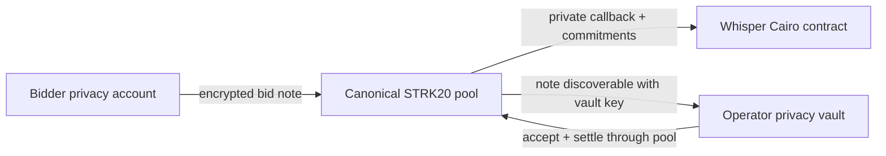

# Whisper

Whisper is a reusable sealed-bid auction protocol for Starknet. Bidders escrow their actual maximum bids as encrypted STRK20 notes; the highest bid wins, but pays the greater of the reserve price and the second-highest bid.

> Whisper currently uses a 1-of-1 operator-controlled privacy vault. It gives bidders a familiar no-reveal auction flow, but it is custodial and unaudited.

## The mental model

Whisper combines three systems, each with a different job:

- **STRK20 provides private value:** encrypted notes, ownership proofs, nullifiers, and value conservation.
- **Whisper provides auction rules:** bid commitments, acceptance deadlines, deterministic Vickrey pricing, and settlement verification.
- **The operator provides custody and availability:** it discovers incoming notes, decrypts bid capsules, and creates private refunds and proceeds.

Whisper does not deploy a second privacy pool and does not require an auction-specific prover circuit. It composes the existing pool's normal note operations with one `ComputeAndInvoke` callback into the Whisper contract.

## One auction in 60 seconds

1. The bidder starts with funds already shielded in the STRK20 pool.
2. The bidder privately creates an exact-value note for the operator vault and commits to the bid details.
3. The pool proves the private transfer and invokes Whisper in the same transaction.
4. The operator discovers the new vault note, decrypts the matching bid capsule, validates it, and marks the bid funded.
5. After the deadline, the operator opens all accepted bids and computes the Vickrey result.
6. One private settlement spends the escrow notes, refunds losers, returns the winner's change, and pays the seller.
7. Whisper verifies the accepted bid set, every opening, the winner, and the clearing price.

[Read the full walkthrough →](/how-whisper-works)

## What “private” means here

| Hidden before settlement | Public before settlement |
|---|---|
| Bid amount and salt | Auction configuration and payment token |
| Bidder wallet behind the private identity | Bid handle and commitments |
| Refund destination and winner payload | Note ID, timing, submission count, funded count |

Settlement reveals the accepted bid amounts, winner, and clearing price. The public chain still does not learn which wallets own the bid notes or private settlement outputs.

The 1-of-1 operator is different: it can decrypt bid amounts as notes arrive, controls the escrowed notes, and is trusted to create the promised outputs. [Read the exact privacy and custody boundary →](/security/privacy-and-trust)

## Recommended reading order

1. [How Whisper works](/how-whisper-works) — the complete end-to-end flow.
2. [Encrypted notes](/concepts/encrypted-notes) — how a private note can have a receiver without naming them publicly.
3. [Bid lifecycle](/auctions/bid-lifecycle) — commitments, deadlines, acceptance, and Vickrey settlement.
4. [Operator architecture](/architecture/operator) — how the backend discovers, validates, and spends vault notes.
5. [Privacy & trust](/security/privacy-and-trust) — what the protocol proves and what users still trust the operator to do.

## Scope

The Cairo package is application-neutral. A game can interpret `winner_commitment` as control of an arbiter, a marketplace can interpret it as a delivery identity, and an NFT adapter can use it to identify the private winner. Whisper only decides which committed bid wins and what it pays.

For the underlying pool model, see [What is STRK20](https://strk20-by-example.org/what-is-strk20), [notes and nullifiers](https://strk20-by-example.org/notes-and-nullifiers), and [actions and proofs](https://strk20-by-example.org/actions-and-proofs).
