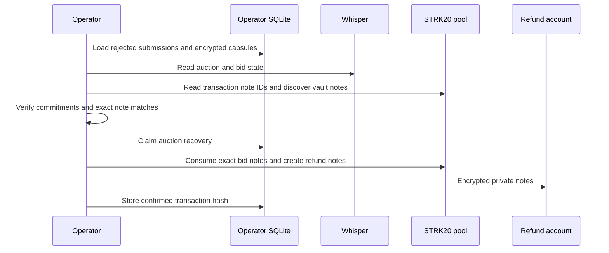

# Rejected-bid recovery

A wallet transfer can succeed while Whisper never funds the bid—for example, if the operator misses the acceptance deadline. The payment note then belongs to the operator vault but is not part of the auction's accepted set. `whisper-recover-auction` returns those rejected, unfunded notes through one exact-input STRK20 private transfer.

This is a custodial operator procedure. Bidders cannot execute it themselves because they no longer own the vault notes.

## Scope

The command only recovers bids that satisfy every condition below:

- the auction has left its acceptance window;
- the local submission is recorded as `rejected`;
- Whisper reports the bid as unfunded with note ID zero;
- the authenticated capsule opens to the bid's refund and winner commitments;
- exactly one unspent vault note from the bid transaction matches the capsule amount; and
- the auction vault matches the configured operator vault.

It does not recover accepted bids, settle the auction, return an escrowed token lot, or provide a bidder-side reclaim path. Funded-auction recovery after `abort_after` remains a separate operator procedure.

## Recovery flow



The refund recipient is a registered Starknet account address, not a viewing public key. The command decrypts it inside the operator process and does not print refund addresses or private amounts.

## Runbook

Use the same public configuration and owner-only secret providers as the operator. Stop the worker first so only the recovery process uses the vault signer, viewing key, discovery cursor, and relayer.

Build and run the default dry-run:

```sh
cd operator
pnpm build
pnpm recover -- --auction-id <auction-id>
```

A successful dry-run reports only the auction ID and number of recoverable notes. It does not build a proof or submit a transaction.

After reviewing the target, execute the batch:

```sh
pnpm recover -- --auction-id <auction-id> --execute
```

Execution:

1. repeats all auction, bid, capsule, commitment, and note checks;
2. re-discovers the selected notes at the same lagged block used for proving;
3. consumes every selected input note in one STRK20 proof;
4. creates one encrypted refund note per rejected bid;
5. submits through the configured outside-execution relayer; and
6. waits for a successful Starknet receipt before recording completion.

See the STRK20 [private transfer guide](https://strk20-by-example.org/sdk/transfer) for the underlying note operation.

## Idempotency and failure handling

SQLite stores one `auction_recoveries` row per auction:

```text
absent/failed → recovering → completed
```

- `completed` returns the stored transaction hash without submitting again.
- `recovering` stops automatic retry because a previous process may have broadcast a transaction that still needs reconciliation.
- `failed` may be planned again, but the operator should first check whether a transaction was broadcast.
- Pool nullifiers independently prevent the same input notes from being spent twice.

If execution fails after proof generation, inspect the relayer transaction status and the `auction_recoveries` row before retrying. Do not delete the recovery row to bypass reconciliation.

## Verify and restart

A complete recovery has all of the following:

- the transaction receipt is successful and accepted on L2;
- the pool emitted one `NoteUsed` for every recovered input;
- the pool emitted one `EncNoteCreated` for every refund output; and
- `auction_recoveries.status` is `completed` with the same transaction hash.

The recipient wallet may need to wait for discovery/finality before its returned note appears. Restart the operator only after the recovery process exits and the receipt is confirmed.

## Mark the auction aborted

Once `abort_after` has passed, use the confirmed recovery transaction to mark the auction terminal. Keep the worker stopped and run the default dry-run first:

```sh
pnpm abort -- --auction-id <auction-id>
pnpm abort -- --auction-id <auction-id> --execute
```

The command requires the auction's `auction_recoveries` row to be `completed`, commits its transaction hash as Whisper's non-zero `recovery_hash`, rotates a mature vault replay note alongside the callback, and waits for a successful receipt. It then reads the auction back and requires `Aborted`. The abort is an onchain recovery record; it does not itself move private funds.

## Privacy and trust boundary

The pool proves note ownership, non-double-spend, and value conservation. The operator still chooses the refund outputs and can decrypt the auction capsule, so the command verifies Whisper's application commitments before constructing them. Onchain observers see pool interaction timing, consumed-note nullifiers, and new encrypted-note events, but not the refund accounts, token, or amounts carried inside those notes.

For the larger custody model and failure modes, see [Privacy & trust](/security/privacy-and-trust).
