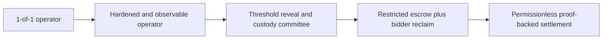

# Privacy & trust

Whisper is confidential from the public and other bidders before settlement. It is **not** confidential from the 1-of-1 operator, and the current vault is custodial.

## Who can see a bid?

| Party | Before settlement | After settlement |
|---|---|---|
| Public observer | Commitments, note ID, timing, counts | Accepted amounts, winner, clearing price, transcript roots |
| Other bidder | Same public data; only their own private note/capsule | Same settlement data; only their own private outputs |
| Operator | Every discovered vault note and decrypted capsule | Complete auction and all vault outputs |
| Auditor under the protocol's disclosure path | Scoped history available through the registered auditor mechanism | Same, limited to disclosed key scope |

The operator can learn bids early. “Sealed bid” here means sealed against the public and competing bidders, not blind to the auction service.

## Hidden and visible data

### Before settlement

| Private | Public |
|---|---|
| Bid amount and salt | Auction token, reserve, capacity, deadlines |
| Wallet behind the pool-derived identity | Bid handle and commitments |
| Vault note token/amount to ordinary observers | Accepted note ID |
| Refund destination | Submission/funded counts and timestamps |
| Winner payload plaintext | Rolling accepted-bid hash |

### After settlement

| Still private | Newly public |
|---|---|
| Wallet ownership of bid and output notes | Every accepted bid amount and salt |
| Refund, change, and seller note recipients | Winning bid, second-highest bid, clearing price |
| Vault viewing key and channel keys | Winner commitment and settlement roots |

The current Cairo settlement must receive the accepted openings to verify Vickrey pricing, so bid amounts do not remain secret forever.

## The pool's guarantees

The canonical STRK20 pool guarantees:

- a spent note was authorized by its owner;
- its nullifier was not used before;
- no token balance becomes negative during the action batch;
- each token ends with inputs equal to outputs; and
- the submitted server actions match the proven client execution.

These guarantees prevent counterfeit value and double spending. They do not understand refund policy, auction deadlines, or Vickrey pricing.

## Whisper's guarantees

The Cairo contract guarantees:

- private state changes come only through the configured pool;
- a contract-scoped identity cannot submit twice to one auction;
- only the committed operator identity can accept, settle, or abort;
- accepted note IDs cannot be reused;
- the complete ordered funded-bid set is used;
- every published amount opens its bid-time commitment;
- the winner and tie-break are deterministic; and
- the clearing price is correct.

It does not hold or decrypt the notes.

## What bidders trust the operator to do

The operator controls the privacy account that owns every escrow note. Bidders therefore trust it to:

- accept every valid note before the deadline;
- not spend escrow outside the advertised settlement;
- not leak bids before the auction ends;
- create outputs at the committed refund and proceeds recipients;
- remain online through settlement or recovery; and
- secure its signer, viewing key, and reveal key.

The contract receives an `outputs_root`, but the standard pool proof does not currently enforce that the actual encrypted output recipients match Whisper's application commitments. That link is an operator attestation.

## Failure modes

| Failure | Current result |
|---|---|
| Discovery indexer is briefly behind | Submission retries until acceptance closes |
| Capsule arrives late or never arrives | Bid cannot be validated or funded |
| Transaction creates multiple candidate vault notes | Submission is rejected as ambiguous |
| Operator misses the acceptance deadline | Bid stays unfunded and should be privately returned by the operator |
| Operator misses the settlement window | Auction can be marked aborted; funds still require operator refunds |
| Operator loses the viewing/signing key | Vault notes may become unrecoverable |
| Operator redirects or withholds outputs | Pool value still balances, but bidders are harmed |

There is no bidder-side permissionless reclaim in this version.

## Public shielding can reveal the bidder

Shielding has a public ERC-20 deposit leg. If a bidder shields exactly 87 tokens and immediately submits a private 87-token bid, timing and amount make the relationship easy to infer.

The safer flow is:

```text
shield earlier
→ wait for note maturity and an anonymity interval
→ bid later from existing private balance
```

The private transfer hides sender, receiver, amount, and token inside the pool, but unique behavior outside the pool can still create correlations.

## Do not attribute a private transaction to its sender field

Private transactions are relayed. The transaction sender is the relayer, not the bidder or vault identity behind the proof.

Any analytics that needs the public depositing account must read the first indexed key of the pool's `Deposit` event. Grouping private activity by transaction sender would incorrectly assign every user to the shared relayer.

## Screening and disclosure

Deposit screening is enforced by the protocol, including when teams configure their own proving infrastructure. Self-hosted proving is not a screening bypass.

The pool supports selective disclosure of the information needed for a legitimate request without disclosing unrelated users. That capability is not automatic compliance, regulator approval, or a substitute for application-specific legal decisions.

## What it would take to become trustless

“Decentralize the operator” is not one change. The current operator combines four independent powers:

| Power | Why it matters |
|---|---|
| **Early visibility** | The vault viewing key and reveal key let the operator learn bid amounts before the deadline. |
| **Custody** | The vault owns the escrow notes and can authorize how they are spent. |
| **Acceptance** | The operator attests that a submitted note matches a bid commitment. |
| **Availability** | The operator is the only party currently equipped to discover notes, produce the settlement call, and create refunds. |

A design is only fully trustless if it removes all four powers. Running three copies of the same service improves uptime, but it does not decentralize anything if each copy uses the same viewing and spending keys.

The [STRK20 sealed-bid auction RFP](https://strk20.starknet.io/rfp/sealed-bid-auctions) describes the desired end state: real funds are locked as encrypted notes, bids stay hidden until reveal, offline bidders can be force-revealed, and settlement does not depend on a trusted auctioneer. Whisper's current architecture is an integration path toward that target, not an implementation of every trustless property in the RFP.

### The hard part: deadline decryption

There is an unavoidable liveness question: if bidders do not return after the deadline and nobody may decrypt bids early, what causes the decryption capability to become available at the deadline?

| Mechanism | Benefit | Remaining assumption |
|---|---|---|
| Bidder reveal | No standing decryptor | Reintroduces a second bidder action and non-reveal griefing. |
| Threshold force-reveal committee | No single member can reveal early | A threshold can collude, go offline, or mishandle key shares. |
| Timelock encryption | Decryption is tied to time rather than one operator | Depends on the timelock construction and its participating infrastructure. |
| Trusted execution environment | Preserves the one-action bidder UX | Replaces operator trust with hardware, attestation, and implementation trust. |
| MPC or private auction proof | Can compute a result without publishing every bid | Adds a custom cryptographic system, distributed execution, and a substantial audit surface. |

Encrypted notes solve private ownership and value transfer; they do not by themselves schedule future decryption. Any no-reveal auction must choose one of these mechanisms or accept an operator that can decrypt early.

### Improvements Whisper can make without changing the pool

The first steps can use the canonical pool unchanged:

1. **Separate operational roles.** Run the capsule reveal service, vault authorization service, settlement builder, and relayer under separate credentials and narrowly scoped interfaces. This limits the effect of one compromised process, although colluding operators still recover the current powers.
2. **Threshold-control the application reveal key.** Encrypt capsules to a committee public key and require a threshold to open them after the deadline. The SDK and capsule format would need committee encryption support. This does not hide the exact-value vault note from anyone who independently holds the ordinary vault viewing key.
3. **Threshold-control the vault account.** Use reviewed MPC or threshold signing so no single machine can spend escrow notes. A normal Starknet multisig protects signing authority but does not solve bid privacy if one participant still holds the complete viewing key.
4. **Replicate public work.** Multiple watchers can index submissions, reproduce the ordered accepted-bid transcript, compute the Vickrey result, and alert on censorship or deadline failures. Once openings are available, the auction result is deterministic even though vault authorization is not yet permissionless.
5. **Add economic and operational accountability.** Operator bonds, slashing conditions, signed acceptance receipts, append-only settlement manifests, HSM-backed keys, backups, and independent monitors make failures detectable or costly. They reduce risk; they do not make custody trustless.

A committee-based deployment is therefore a meaningful middle state, but only when both decryption and spending are threshold-controlled. Giving several servers the same complete viewing key creates more parties that can leak bids rather than stronger privacy.

### Capabilities that require pool or prover changes

The larger custody guarantees cannot be added by the Whisper contract alone. The contract cannot inspect encrypted note fields, and the standard pool proof currently proves value conservation rather than Whisper's auction policy.

| Missing capability | General primitive needed |
|---|---|
| **Restricted escrow** | An encumbered or policy-owned note that cannot be spent except through the auction's settlement or recovery paths. |
| **Bidder reclaim** | A timelocked alternate spend path that returns an accepted note to its committed bidder-controlled destination after `abort_after`, without the vault key. |
| **Funding binding** | A proof that the accepted note ID, token, hidden amount, auction ID, and bid commitment are mutually consistent. This would replace `AcceptBid` as an operator attestation. |
| **Output binding** | A proof that the actual seller, refund, change, and winner outputs match Whisper's committed destinations and verified clearing price. |
| **Threshold visibility** | Threshold note encryption/decryption, or an MPC-compatible SDK path, so no one participant holds a complete viewing key before the deadline. |
| **Private result verification** | An application proof that the winner and second price were computed over the complete funded set without publishing every losing bid. |

These should preferably be general privacy-pool primitives—conditional notes, application-bound proof inputs, and restricted outputs—rather than auction logic hardcoded into STRK20. Whisper could then express its rules through commitments consumed by the pool/prover.

This does **not** necessarily mean deploying a separate auction privacy pool. Upgrading the canonical pool and prover interface, or adding an audited composition mechanism recognized by it, preserves the shared anonymity set. A standalone auction pool would fragment liquidity and anonymity, require a separate security review, and no longer be a straightforward integration with the existing mainnet pool.

### A practical decentralization sequence



| Stage | Result | Pool change? |
|---|---|---|
| 1. Hardened operator | Better key security, availability, auditability, and incident recovery | No |
| 2. Threshold committee | No single operator can decrypt or spend; committee collusion remains | Not necessarily, if a reviewed MPC layer can safely operate one ordinary privacy account |
| 3. Restricted escrow | The committee cannot steal funds and bidders gain a unilateral timeout recovery path | Yes, or an equivalent audited pool-recognized proof extension |
| 4. Proof-backed settlement | Anyone can submit a settlement that the pool and Whisper jointly verify | Yes; requires application-bound note authorization and independent cryptographic review |

The lowest-risk next step after the hackathon is Stage 1, followed by a narrowly scoped threshold-custody prototype. Stage 3 is the point where the main custody claim materially changes: until restricted spending and bidder reclaim exist, users are still trusting some operator or committee with their escrow.

This sequence is a proposed Whisper architecture, not a published STRK20 protocol roadmap. Any pool/prover extension would need agreement from the privacy-pool maintainers, a precise public specification, compatibility with the canonical pool, and independent Cairo and cryptographic audits before meaningful funds use it.

For the general model, see [builder privacy overview](https://strk20-by-example.org/builder-privacy-overview) and [compliance and selective disclosure](https://strk20-by-example.org/compliance).
